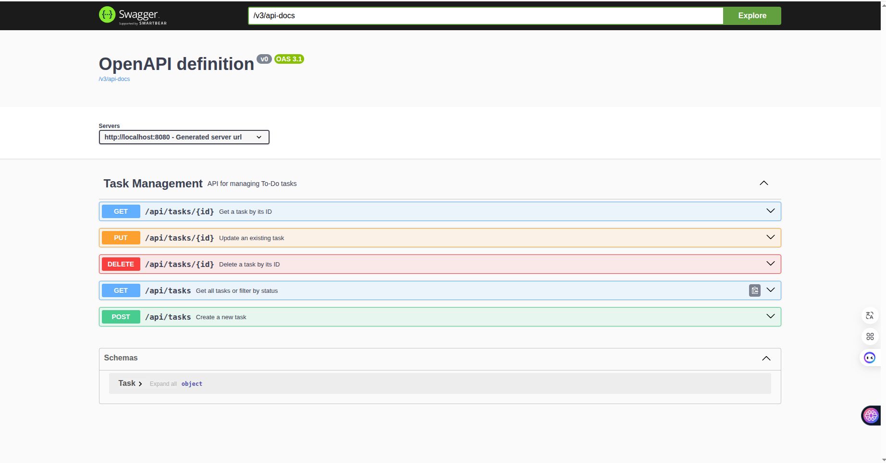

# To-Do List API (Spring Boot)

This is a RESTful API for managing a list of tasks, developed using Spring Boot.

## Features

* **Create Task**: Add a new task with a title, description, and status.
* **Get All Tasks**: Retrieve all tasks, with an option to filter by status.
* **Get Task by ID**: Retrieve a single task by its unique identifier.
* **Update Task**: Modify the title, description, or status of an existing task.
* **Delete Task**: Remove a task from the list.

## Technologies Used

* **Spring Boot**: Framework for building the application.
* **Spring Data JPA**: For database interaction and ORM.
* **PostgreSQL**: Relational database for storing task data.
* **Lombok**: Reduces boilerplate code (getters, setters, etc.).
* **SpringDoc OpenAPI UI (Swagger)**: For API documentation and testing.
* **Maven**: Build automation tool.

## How to Run the API

### Prerequisites

* **Java 17+**
* **Maven**
* **Docker** (recommended for easily running PostgreSQL) or a locally installed PostgreSQL instance.

### 1. Database Setup (PostgreSQL)

If you have Docker installed, you can quickly spin up a PostgreSQL database:

```bash
docker run --name todo-postgres -e POSTGRES_DB=todo_db -e POSTGRES_USER=user -e POSTGRES_PASSWORD=password -p 5433:5432 -d postgres:17-alpine
```
This command will:
    Create and run a new Docker container named todo-postgres.
    Set up a PostgreSQL 17 database.
    Map port 5433 on your host machine to port 5432 inside the container.
    Initialize a database named todo_db with user user and password password.

### 2. Configure Application Properties

Open `src/main/resources/application.properties` and ensure the database connection details match your PostgreSQL setup, especially the port `5433` for the Dockerized database:

properties
spring.datasource.url=jdbc:postgresql://localhost:5433/todo_db
spring.datasource.username=user
spring.datasource.password=password
spring.datasource.driver-class-name=org.postgresql.Driver
spring.jpa.hibernate.ddl-auto=update # For development, creates/updates schema automatically
spring.jpa.show-sql=true
spring.jpa.properties.hibernate.format_sql=true
spring.jpa.properties.hibernate.dialect=org.hibernate.dialect.PostgreSQLDialect
server.port=8080 # Your API will run on this port

### 3. Build the Application

Navigate to the root directory of the project in your terminal (where pom.xml is located) and run:
Bash

mvn clean install

This command compiles the project and packages it into an executable JAR file.

### 4. Run the Application

You can run the application using the Spring Boot Maven plugin:
Bash

mvn spring-boot:run

Alternatively, you can run the generated JAR file directly:
Bash

java -jar target/todo-api-0.0.1-SNAPSHOT.jar # Adjust version if different (e.g., 1.0.0)

Or instead, you can run the application directly from your IDE.

The API will start and listen for requests on http://localhost:8080.

### 5. Access API Documentation (Swagger UI)

Once the application is running, open your web browser and navigate to:

http://localhost:8080/swagger-ui/index.html

Here you can view all the API endpoints, their details, and test them directly through the interactive UI.

For a visual reference, here's what the Swagger UI looks like:


## Troubleshooting Database Connection Issues

If you encounter errors when trying to run the Spring Boot API, especially related to database connection, here are common issues and their solutions:

### Error 1: "Connection to localhost:5433 refused..." (or similar port)

This error indicates that your Spring Boot application cannot connect to the PostgreSQL database on the specified port. The database container is likely not running or not accessible.

**Solution:**

1.  **Ensure Docker Desktop/Daemon is Running:**
    Verify that your Docker environment is active.
    * **On Linux:** Check `sudo systemctl status docker` and if not running, start with `sudo systemctl start docker`.
    * **On macOS/Windows:** Ensure your Docker Desktop application is open and running.

2.  **Check if the `todo-postgres` container is running:**
    Open your terminal and list all Docker containers (running or stopped):
    ```bash
    docker ps -a
    ```
    Look for a container named `todo-postgres`.
    * If its `STATUS` is `Exited (...)`: The container is stopped. Start it:
        ```bash
        docker start todo-postgres
        ```
    * If you don't see `todo-postgres` listed at all: The container doesn't exist. Re-run the initial setup command from **Step 1: Database Setup (PostgreSQL)**:
        ```bash
        docker run --name todo-postgres -e POSTGRES_DB=todo_db -e POSTGRES_USER=user -e POSTGRES_PASSWORD=password -p 5433:5432 -d postgres:17-alpine
        ```
    * After starting or running, verify it's `Up` using `docker ps`.

### Error 2: "Error response from daemon: Conflict. The container name "/todo-postgres" is already in use..."

This means a Docker container with the name `todo-postgres` already exists (even if stopped) and Docker won't let you create another with the same name.

**Solution:**

1.  **Stop the existing container (if running):**
    ```bash
    docker stop todo-postgres
    ```
2.  **Remove the container:**
    ```bash
    docker rm todo-postgres
    ```
3.  **Now, re-run the Docker command from Step 1** to create a fresh container:
    ```bash
    docker run --name todo-postgres -e POSTGRES_DB=todo_db -e POSTGRES_USER=user -e POSTGRES_PASSWORD=password -p 5433:5432 -d postgres:17-alpine
    ```

After resolving any Docker issues, try running your Spring Boot application again.

---

## API Endpoints

All endpoints are prefixed with `/api/tasks`.

| Method   | Endpoint          | Description                                       | Request Body Example                 | Query Parameters   |
| :------- | :---------------- | :------------------------------------------------ | :----------------------------------- | :----------------- |
| `POST`   | `/api/tasks`      | Creates a new task. The `id` is auto-generated. | `{"title": "Buy groceries", "description": "Milk, eggs, bread", "status": "TO_DO"}` |                    |
| `GET`    | `/api/tasks`      | Retrieves all tasks.                              | None                                 | `status` (optional, e.g., `TO_DO`) |
| `GET`    | `/api/tasks/{id}` | Retrieves a single task by its unique ID.         | None                                 |                    |
| `PUT`    | `/api/tasks/{id}` | Updates an existing task by ID.                   | `{"title": "Walk dog", "description": "Around the park", "status": "IN_PROGRESS"}` |                    |
| `DELETE` | `/api/tasks/{id}` | Deletes a task by ID.                             | None                                 |                    |

**Example `TaskStatus` values for `status` field:** `TO_DO`, `IN_PROGRESS`, `COMPLETED`

---
